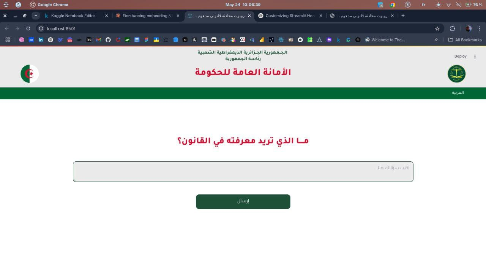
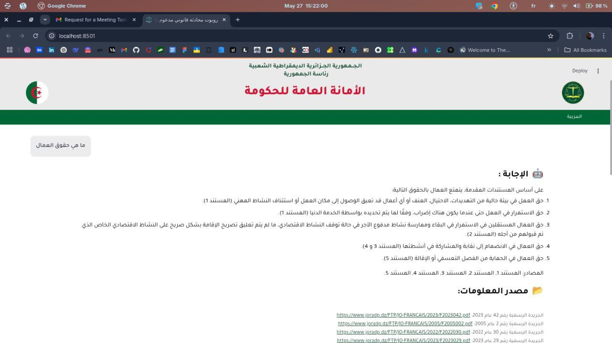

# 🇩🇿  Algerian Laws Bot

**Algerian Laws Bot** is an AI assistant that can answer any legal question based on the official Algerian laws published in the [*Journal Officiel*](https://www.joradp.dz/HFR/Index.htm). It reads and understands the content of these official gazettes, then allows users to search or ask questions in natural language — and get answers directly from the source.

## Tools and Technologies

We combined several tools and models to make this possible:

- **PDF Extraction**: PyMuPDF and OCR
- **Embeddings**: Tested many different models (sentence-level and paragraph-level) to convert legal text into searchable vectors, and the final one used is [`sentence-transformers/paraphrase-multilingual-MiniLM-L12-v2`](https://huggingface.co/sentence-transformers/paraphrase-multilingual-MiniLM-L12-v2)
- **Vector Database**: FAISS for fast and efficient similarity search  
- **Language Models**: Used hosted LLMs like **DeepSeek**, **ChatGPT**, **Bloomz**,etc., to generate answers  
- **RAG Approach**: Combined search (retrieval) with AI-generated answers (generation) for accurate and context-aware responses

## Interface

The application is built using **Streamlit**, providing a simple and interactive web interface where users can:

- Ask legal questions in any language
- View AI-generated answers with references to the source documents
- Explore matched articles from the *Journal Officiel*.

### Example

  
  

##  Future Work

- Add support for more years of the *Journal Officiel*  
- Implement user authentication, favorites/bookmarks, and chat history  
- Contact the *Journal Officiel* authority to obtain high-quality official documents.
- Use local LLMs to ensure better data privacy and protection.

## Final Note

This project aims to make Algerian legal texts more accessible and easier to understand using the power of AI. It’s still a work in progress, and any feedback or ideas are welcome!

